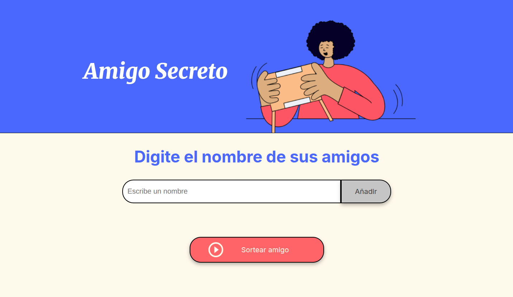

# Amigo Secreto

Este es un sencillo juego web de "Amigo Secreto" desarrollado con HTML, CSS y JavaScript puro.

## Descripción
Permite a los usuarios ingresar nombres de amigos en una lista y, posteriormente, realizar un sorteo aleatorio para determinar quién es el "amigo secreto".

## Características principales
- **Agregar nombres:** Los usuarios pueden escribir el nombre de un amigo y añadirlo a una lista visible.
- **Validación:** Si el campo de texto está vacío, se muestra una alerta pidiendo un nombre válido.
- **Visualización dinámica:** Los nombres ingresados aparecen en una lista debajo del campo de entrada.
- **Sorteo aleatorio:** Al hacer clic en el botón "Sortear amigo", se selecciona aleatoriamente un nombre de la lista y se muestra el resultado en pantalla. La lista desaparece tras el sorteo.

## ¿Cómo usar?
1. Escribe el nombre de un amigo en el campo de texto.
2. Haz clic en "Añadir" para agregarlo a la lista.
3. Repite el proceso para todos los amigos que quieras incluir.
4. Haz clic en "Sortear amigo" para elegir aleatoriamente un amigo secreto.

## Estructura de archivos
- `index.html`: Estructura principal de la página.
- `style.css`: Estilos visuales y responsivos.
- `app.js`: Lógica del juego (agregar, mostrar y sortear amigos).# Mi Juego Arcade

## 🎮 URL del juego
[Jugar aquí]()  

## 👤 Autor  
**Hecho por [Wuilfredo Fuentes](https://github.com/wuilfredo5)**  

  

## Créditos
Desarrollado como parte de un desafío de programación.
